# Clawland Fleet Architecture

Complete deployment architecture and data flow diagrams for the Clawland edge AI network.

---

## Table of Contents

- [Overview](#overview)
- [Three-Tier Architecture](#three-tier-architecture)
- [Data Flow Diagram](#data-flow-diagram)
- [Network Topology](#network-topology)
- [Component Interaction](#component-interaction)
- [Failure Scenarios](#failure-scenarios)
- [Deployment Examples](#deployment-examples)

---

## Overview

Clawland Fleet orchestrates a three-tier edge AI network:

| Layer | Agent | Hardware | Role |
|-------|-------|----------|------|
| **L1** | MicroClaw, PicoClaw | $2-10 MCU/SBC | Sensor reading, local rules |
| **L2** | NanoClaw | $50 SBC (Raspberry Pi) | Regional gateway, aggregation |
| **L3** | MoltClaw, Fleet Manager | Cloud / Mac Mini | Orchestration, global state |

---

## Three-Tier Architecture


---

## Data Flow Diagram

### Sensor Data Upload (L1 → L2 → L3)

```mermaid
sequenceDiagram
    participant MC as MicroClaw (L1)
    participant NC as NanoClaw (L2)
    participant EH as Event Hub (L3)
    participant FM as Fleet Manager (L3)
    
    Note over MC: Sensor reads<br/>temperature: 25°C
    
    MC->>MC: Validate reading<br/>(range check)
    MC->>NC: MQTT Publish<br/>clawland/sensor-01/temp<br/>{"value": 25.0}
    
    NC->>NC: Aggregate data<br/>(last 1 min)
    NC->>EH: MQTT Publish<br/>clawland/gateway-01/batch<br/>[{"sensor": "01", ...}]
    
    EH->>FM: Event notification<br/>(new sensor data)
    FM->>FM: Store in DB<br/>Run alerts/rules
    
    alt Temperature > 30°C
        FM->>NC: Command<br/>{"action": "alert", "target": "sensor-01"}
        NC->>MC: MQTT Subscribe<br/>clawland/sensor-01/cmd
        MC->>MC: Trigger local alarm
    end
```



### Command Dispatch (L3 → L2 → L1)


---

## Network Topology

### Option 1: LAN + WiFi


### Option 2: 4G/LTE (Remote Deployment)


### Option 3: LoRa (Ultra-Low Power)


---

## Component Interaction

### Fleet Manager Components


### NanoClaw Regional Gateway


---

## Failure Scenarios

### Scenario 1: Cloud Connection Lost

```mermaid
sequenceDiagram
    participant MC as MicroClaw
    participant NC as NanoClaw
    participant Cloud as Fleet Manager
    
    MC->>NC: Sensor data<br/>(temp: 32°C)
    NC->>Cloud: Forward data<br/>(MQTT)
    
    Note over Cloud: ❌ Network outage
    
    NC->>NC: Detect connection loss<br/>(heartbeat timeout)
    NC->>NC: Enter offline mode<br/>(activate local rules)
    
    MC->>NC: Sensor data<br/>(temp: 35°C)
    NC->>NC: Check local threshold<br/>(>30°C = alert)
    NC->>MC: Send alert command<br/>(no cloud dependency)
    
    Note over Cloud: ✅ Network restored
    
    NC->>Cloud: Reconnect<br/>(resync buffered data)
    NC->>Cloud: Upload cached readings<br/>(catchup mode)
```



### Scenario 2: Regional Gateway Failure


**Fallback Mechanism**:
1. L1 nodes send mDNS/beacon every 30s
2. If primary gateway silent >90s, L1 scans for fallback
3. Fallback gateway announces: `_clawland._tcp.local`
4. L1 reconnects to fallback, resumes operation

### Scenario 3: Sensor Node Failure

```mermaid
sequenceDiagram
    participant MC as MicroClaw
    participant NC as NanoClaw
    participant FM as Fleet Manager
    
    MC->>NC: Heartbeat<br/>(every 60s)
    NC->>FM: Node status<br/>(healthy)
    
    Note over MC: ❌ Power loss
    
    NC->>NC: Wait for next heartbeat<br/>(timeout: 180s)
    NC->>NC: Mark node as DOWN
    NC->>FM: Alert: Node offline<br/>{"sensor": "01", "status": "down"}
    
    FM->>FM: Trigger notification<br/>(email/Slack)
    
    Note over MC: ✅ Power restored
    
    MC->>NC: Reconnect + backlog<br/>(cached readings)
    NC->>FM: Alert: Node recovered<br/>{"sensor": "01", "status": "up"}
```



---

## Deployment Examples

### Example 1: Office Building (Small)

```
L3 (Cloud): MoltClaw on AWS t3.small ($10/month)
L2 (Gateway): 1x NanoClaw (Pi 4) per floor
L1 (Sensors): 10x MicroClaw per floor
- Temperature/humidity in each room
- Motion sensors on doors
- CO2 monitors in meeting rooms

Total: 3 floors = 3 gateways + 30 sensors
Cost: $10/month (cloud) + $150 (Pi) + $60 (sensors)
```

### Example 2: Factory (Medium)

```
L3 (Cloud): MoltClaw on DigitalOcean droplet ($20/month)
L2 (Gateway): 5x NanoClaw (Pi 4) per production zone
L1 (Sensors): 50x MicroClaw across zones
- Vibration sensors on machinery
- Temperature probes on critical equipment
- Door sensors on storage rooms
- Water leak detectors

Total: 5 zones = 5 gateways + 50 sensors
Cost: $20/month (cloud) + $250 (Pi) + $100 (sensors)
```

### Example 3: Smart Farm (Large, LoRa)

```
L3 (Cloud): MoltClaw on VPS ($15/month)
L2 (Gateway): 10x NanoClaw (Pi 4 + LoRa) covering 100 hectares
L1 (Sensors): 200x MicroClaw with LoRa modules
- Soil moisture sensors (every 0.5 hectare)
- Weather stations (every 10 hectares)
- Livestock tracking (GPS collars)

Total: 10 gateways + 200 sensors
Cost: $15/month (cloud) + $500 (Pi + LoRa) + $400 (sensors)
LoRa range: Up to 5km in open terrain
```

---

## Scaling Characteristics

| Metric | Small | Medium | Large |
|--------|-------|--------|-------|
| **L1 Nodes** | 10-50 | 50-500 | 500+ |
| **L2 Gateways** | 1-3 | 3-10 | 10-100 |
| **L3 Cloud** | Single instance | Load balanced | Multi-region |
| **Data Rate** | <1 MB/day | 1-100 MB/day | >100 MB/day |
| **Cost/Month** | <$50 | $50-500 | >$500 |

---

## Technology Stack

| Component | Technology | Port/Protocol |
|-----------|-----------|---------------|
| **Fleet Manager** | Go, Gin framework | 8080 (HTTP) |
| **Event Hub** | Mosquitto MQTT | 1883 (MQTT), 8883 (MQTTS) |
| **Database** | PostgreSQL 15+ | 5432 |
| **Cache** | Redis | 6379 |
| **NanoClaw** | Python 3.9+ | MQTT client |
| **PicoClaw** | Go | MQTT client |
| **MicroClaw** | C/C++ (Arduino) | MQTT client |

---

## Security Considerations

### Authentication
- **L1 → L2**: Pre-shared keys (PSK) in MQTT
- **L2 → L3**: TLS client certificates
- **API**: JWT tokens with role-based access

### Network Isolation
- L1 sensors on isolated VLAN (no internet access)
- L2 gateways have dual NICs (sensor LAN + uplink WAN)
- L3 Fleet Manager exposed via reverse proxy (nginx)

### Data Encryption
- MQTT over TLS (port 8883)
- At-rest encryption for PostgreSQL
- End-to-end encryption for sensitive sensor data

---

**Built for Clawland Fleet Issue #4** 🚀

For implementation details, see:
- [Fleet API Spec](../docs/api-spec.md) (Issue #1)
- [Node Registration Service](../pkg/registry/) (Issue #2)
- [Event Hub Implementation](../pkg/eventhub/) (Issue #3)
