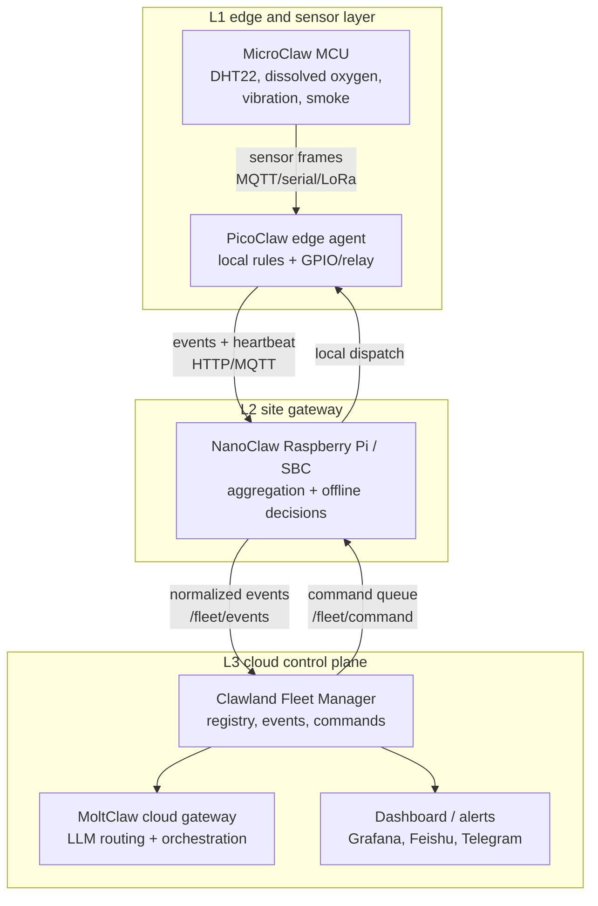
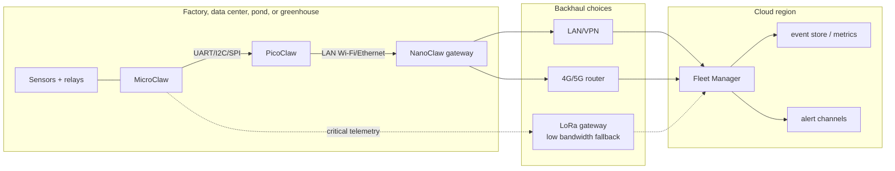
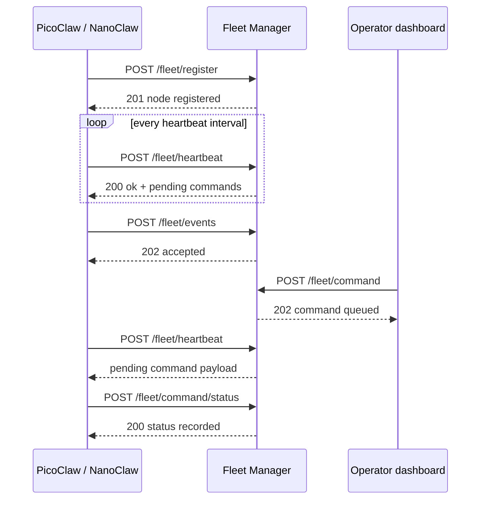
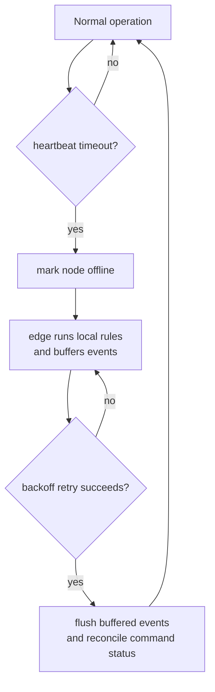

# Clawland Fleet Deployment Architecture

This document maps the production topology for a Clawland installation, from
sensor-level agents through the regional gateway and up to the cloud Fleet
Manager.

## L1 → L2 → L3 data flow

## Network topology options

## Component interaction sequence

## Failure scenarios and fallback paths

| Scenario | Detection | Fallback behavior | Recovery signal |
| --- | --- | --- | --- |
| L1 sensor stops reporting | PicoClaw misses sensor read deadline | PicoClaw reports a `sensor_stale` event and keeps last known safe actuator state | Sensor read succeeds again |
| PicoClaw loses WAN access | Fleet heartbeat timeout marks node offline | NanoClaw stores events locally and applies offline decision rules | Next successful heartbeat |
| NanoClaw gateway fails | Fleet stops seeing all site nodes | PicoClaw continues local threshold actions and buffers events | Gateway registration refresh |
| Cloud Fleet Manager unavailable | Edge HTTP requests fail or time out | Edge agents keep a bounded store-and-forward queue and retry with backoff | `/fleet/heartbeat` returns 200 |
| Command delivery fails | Command remains pending past TTL | Fleet marks command failed and emits an operator alert | Command status update or replacement command |

